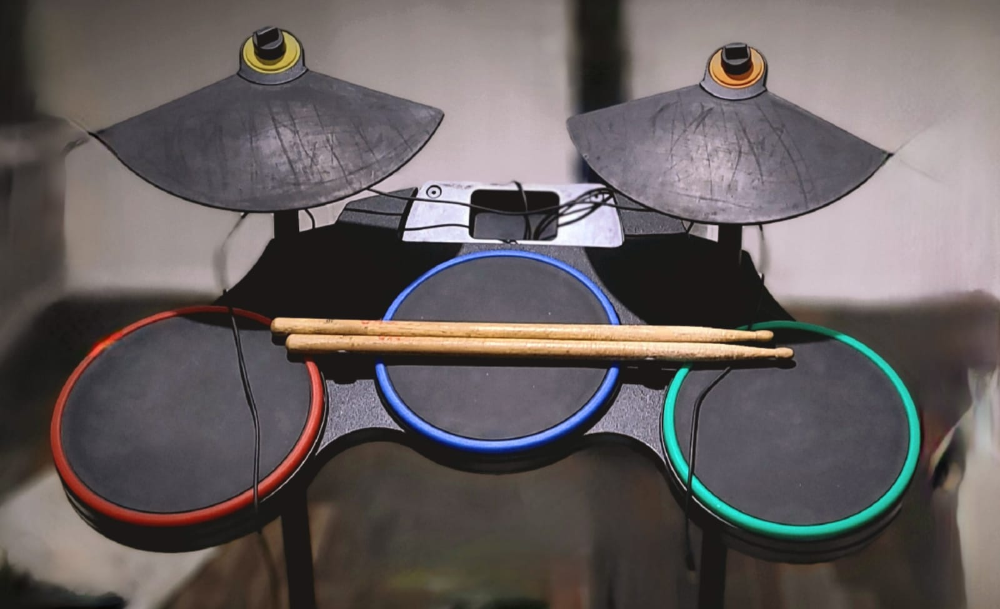

# Arduino MIDI drum
Simple DIY drum based on a Guitar hero Drum set.

Recognized as an USB MIDI controller, working in any MIDI capable device (Computers, Phones, etc...).

## Resources needed
- Arduino compatible micro-controller
    - With USB capabilities (e.g. atmega32u4)
- Piezo sensors (As much as needed)
- 1M Ω resistors (One for each piezo sensor)
- Soldering iron and solder wire
- *(Optional but recommended)* Guitar hero drum set

---
Example of circuit

# Sensor configuration
On [Sensor.h](/Sensor.h) file you will find available configurations and definitions for each sensor out-of-the-box.
Sensors should be reflected in [MIDIDrum.ino](/MIDIDrum.ino) at `sensors array` variable.

Note: I've found that some pads on my *Guitar Hero Drum set* work better with quadratic distribution of force instead of linearly mapping the `analogRead` to the `MIDI velocity` value. If you found that this does not work for you, simply change the `sensibility` property in your sensors for 1.

# MIDI notes table
Please find below a table containing MIDI notes in decimal, these numbers shall be used when emitting notes.

<table>
 <tr>
  <th>Octave</th>
  <th>C</th>
  <th>C#</th>
  <th>D</th>
  <th>D#</th>
  <th>E</th>
  <th>F</th>
  <th>F#</th>
  <th>G</th>
  <th>G#</th>
  <th>A</th>
  <th>A#</th>
  <th>B</th>
 </tr>
 <tr>
  <td><b>0</b></td>
  <td>0</td>
  <td>1</td>
  <td>2</td>
  <td>3</td>
  <td>4</td>
  <td>5</td>
  <td>6</td>
  <td>7</td>
  <td>8</td>
  <td>9</td>
  <td>10</td>
  <td>11</td>
 </tr>
 <tr>
  <td><b>1</b></td>
  <td>12</td>
  <td>13</td>
  <td>14</td>
  <td>15</td>
  <td>16</td>
  <td>17</td>
  <td>18</td>
  <td>19</td>
  <td>20</td>
  <td>21</td>
  <td>22</td>
  <td>23</td>
 </tr>
 <tr>
  <td><b>2</b></td>
  <td>24</td>
  <td>25</td>
  <td>26</td>
  <td>27</td>
  <td>28</td>
  <td>29</td>
  <td>30</td>
  <td>31</td>
  <td>32</td>
  <td>33</td>
  <td>34</td>
  <td>35</td>
 </tr>
 <tr>
  <td><b>3</b></td>
  <td>36</td>
  <td>37</td>
  <td>38</td>
  <td>39</td>
  <td>40</td>
  <td>41</td>
  <td>42</td>
  <td>43</td>
  <td>44</td>
  <td>45</td>
  <td>46</td>
  <td>47</td>
 </tr>
 <tr>
  <td><b>4</b></td>
  <td>48</td>
  <td>49</td>
  <td>50</td>
  <td>51</td>
  <td>52</td>
  <td>53</td>
  <td>54</td>
  <td>55</td>
  <td>56</td>
  <td>57</td>
  <td>58</td>
  <td>59</td>
 </tr>
 <tr>
  <td><b>5</b></td>
  <td>60</td>
  <td>61</td>
  <td>62</td>
  <td>63</td>
  <td>64</td>
  <td>65</td>
  <td>66</td>
  <td>67</td>
  <td>68</td>
  <td>69</td>
  <td>70</td>
  <td>71</td>
 </tr>
 <tr>
  <td><b>6</b></td>
  <td>72</td>
  <td>73</td>
  <td>74</td>
  <td>75</td>
  <td>76</td>
  <td>77</td>
  <td>78</td>
  <td>79</td>
  <td>80</td>
  <td>81</td>
  <td>82</td>
  <td>83</td>
 </tr>
 <tr>
  <td><b>7</b></td>
  <td>84</td>
  <td>85</td>
  <td>86</td>
  <td>87</td>
  <td>88</td>
  <td>89</td>
  <td>90</td>
  <td>91</td>
  <td>92</td>
  <td>93</td>
  <td>94</td>
  <td>95</td>
 </tr>
</table>

*If further notes required check [this generator script](/midi-notes-table-generator.js), used for generating the above table*
